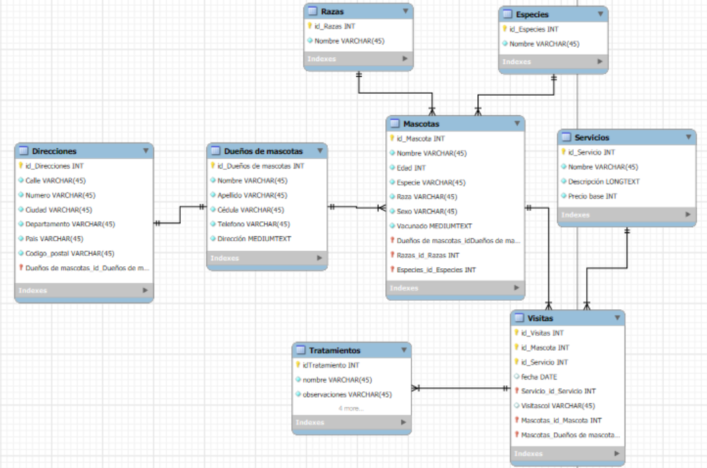

# 🐾 Proyecto Base de Datos - Veterinaria

Este repositorio contiene el desarrollo de un sistema de base de datos para una veterinaria, cumpliendo con los requisitos de modelado, implementación y consultas SQL.

## 📌 Objetivo

Diseñar una base de datos relacional que permita registrar y consultar información sobre dueños, mascotas, servicios veterinarios, visitas y tratamientos, manteniendo la normalización y buenas prácticas de modelado.

---

## 📐 Diseño de la base de datos

### Diagrama UML E-R

El diseño del modelo se realizó utilizando **MySQL Workbench**, donde se construyeron las entidades, relaciones, cardinalidades, claves primarias y foráneas de forma visual.

📷 **Imagen del diagrama** 

#### Entidades:

- **Dueño**
- **Mascota**
- **Servicio**
- **Visita**
- **Tratamiento**
- **Dirección** (Es la dirección de cada usuario)
- **Especie** (Es la especie de cada mascota)
- **Raza** (Es la raza de cada mascota)

#### Relaciones clave:

- Un **dueño** puede tener muchas **mascotas** (1:N)
- Una **mascota** pertenece a un solo **dueño**
- Una **mascota** puede tener muchas **visitas**
- Una **visita** está asociada a una **mascota** y un **servicio**
- Una **visita** puede tener un **tratamiento**
- Un **dueño** tiene una **dirección** (1:1)

---

## Archivos incluidos

### `estructura.sql` (DDL)

Contiene las sentencias `CREATE TABLE` para todas las entidades y relaciones. Incluye:

- Claves primarias y foráneas
- Tipos de datos
- Restricciones de integridad

### 📄 `datos.sql` (DML)

Incluye datos de prueba:

- 5 dueños
- 10 mascotas
- 5 servicios
- 10 visitas
- 5 tratamientos
- 5 direcciones (relacionadas 1:1 con los dueños)

### 📄 `consultas.sql` (DQL)

Incluye al menos 15 consultas que demuestran el uso de:

- Subconsultas
- Alias en campos y subconsultas
- Funciones de agregación: `COUNT`, `AVG`, `MAX`, etc.
- Funciones de texto: `CONCAT`, `UPPER`, `LOWER`, `SUBSTRING`, `TRIM`
- Funciones numéricas: `ROUND`
- Condicionales con `IF`
- Operaciones con `JOIN`, `GROUP BY`, `ORDER BY`
- Creación de tablas a partir de consultas

---

## ⚙️ Proceso de desarrollo

1. **Modelado**: Se identificaron las entidades clave a partir de los requisitos de la veterinaria.
2. **Normalización**: Se normalizaron los datos hasta tercera forma normal, incluyendo una tabla separada para Direcciones.
3. **Diagrama UML E-R**: Se creó visualmente en MySQL Workbench y se exportó como imagen.
4. **Implementación**: Se construyeron las tablas con SQL (DDL), se insertaron datos (DML) y se elaboraron consultas complejas (DQL).
5. **Documentación**: Este archivo `README.md` documenta todo el proceso y el contenido del repositorio.

---

## 🚀 Herramientas utilizadas

- 🐬 MySQL Workbench (modelado y consultas)
- 📸 Captura del diagrama en formato PNG
- 💻 VS Code para escritura de código SQL
- 📁 Git y GitHub para control de versiones y entrega

---

## 🎥 Video explicación de las consultas
https://youtu.be/JJGpcP0_u70?si=QNRQNkw9Ppsf9UEc

## 👤 Autor

**Alejandro Naranjo Marín** 

---

